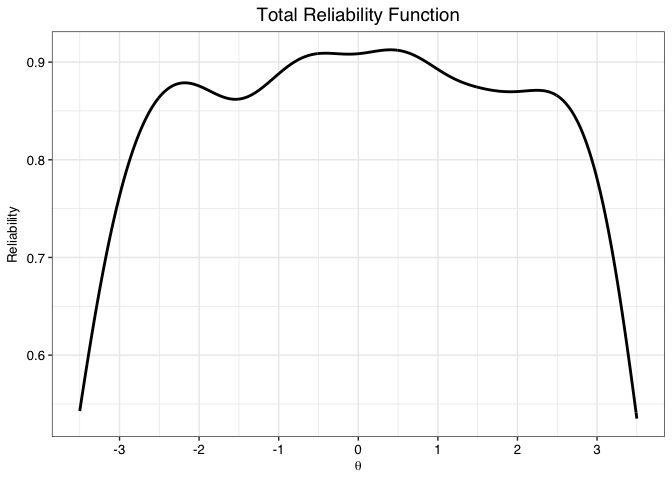
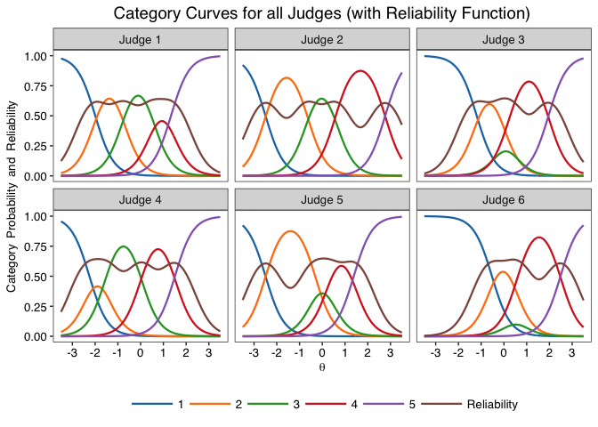
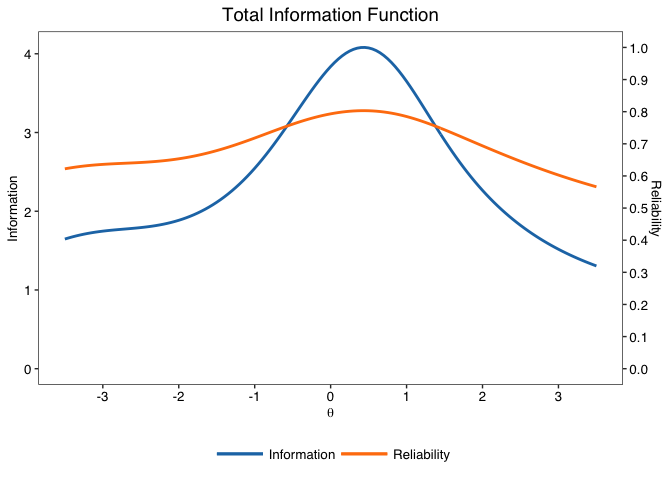
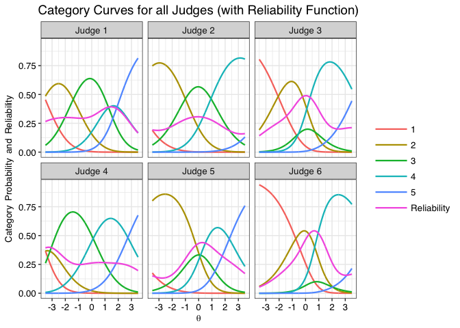
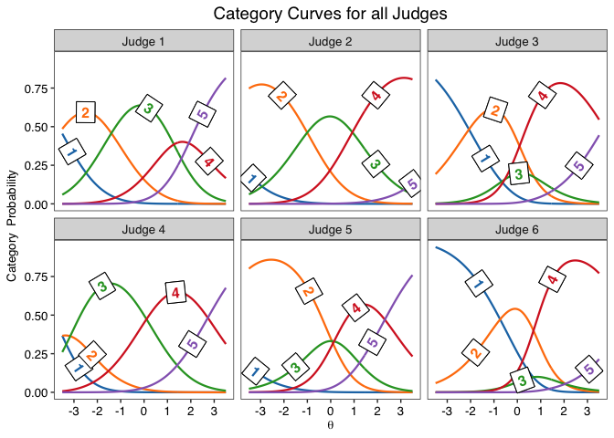
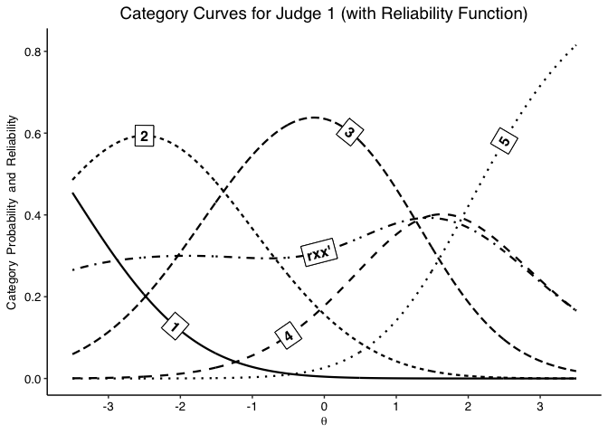
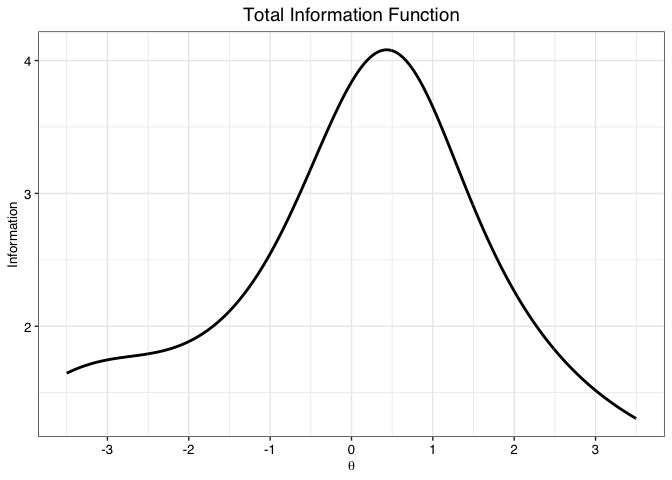
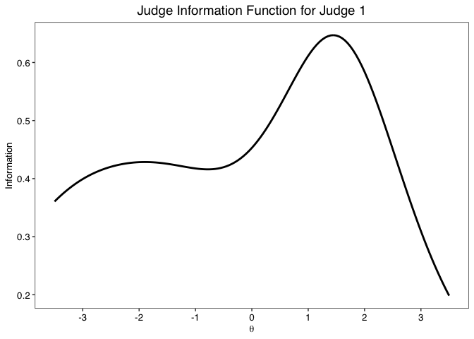
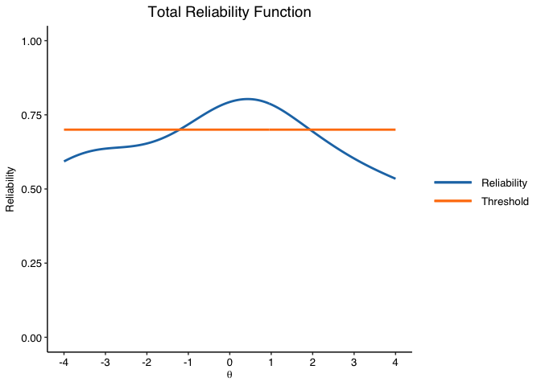

<!-- README.md is generated from README.Rmd. Please edit that file -->

# jrt

The goal of jrt is to provide tools to use Item-Response Theory (IRT)
models on judgment data, especially in the context of the Consensual
Assessment Technique, as presented in Myszkowski (2021).

-   Myszkowski, N. (2021). Development of the R library “jrt”: Automated
    item response theory procedures for judgment data and their
    application with the consensual assessment technique. *Psychology of
    Aesthetics, Creativity, and the Arts, 15*(3), 426-438.
    <http://dx.doi.org/10.1037/aca0000287>

## Installation

You can install the released version of jrt from
[CRAN](https://CRAN.R-project.org) with:

``` r
install.packages("jrt")
```

## Example use

-   Load the library

``` r
library(jrt)
#> Loading required package: directlabels
```

-   Load example dataset

``` r
data <- jrt::ratings
```

-   To automatically select models

``` r
fit <- jrt(data, progress.bar = F)
#> The possible responses detected are: 1-2-3-4-5
#> 
#> -== Model Selection (6 judges) ==-
#> AIC for Rating Scale Model: 4414.163 | Model weight: 0.000
#> AIC for Generalized Rating Scale Model: 4368.776 | Model weight: 0.000
#> AIC for Partial Credit Model: 4022.956 | Model weight: 0.000
#> AIC for Generalized Partial Credit Model: 4014.652 | Model weight: 0.000
#> AIC for Constrained Graded Rating Scale Model: 4399.791 | Model weight: 0.000
#> AIC for Graded Rating Scale Model: 4308.616 | Model weight: 0.000
#> AIC for Constrained Graded Response Model: 3999.248 | Model weight: 0.673
#> AIC for Graded Response Model: 4000.689 | Model weight: 0.327
#>  -> The best fitting model is the Constrained Graded Response Model.
#> 
#>  -== General Summary ==-
#> - 6 Judges
#> - 300 Products
#> - 5 response categories (1-2-3-4-5)
#> - Mean judgment = 2.977 | SD = 0.862
#> 
#> -== IRT Summary ==-
#> - Model: Constrained (equal slopes) Graded Response Model (Samejima, 1969) | doi: 10.1007/BF03372160
#> - Estimation package: mirt (Chalmers, 2012) | doi: 10.18637/jss.v048.i06
#> - Estimation algorithm: Expectation-Maximization (EM; Bock & Atkin, 1981) | doi: 10.1007/BF02293801
#> - Method of factor scoring: Expected A Posteriori (EAP)
#> - AIC = 3999.248 | AICc = 4003.993 | BIC = 4091.843 | SABIC = 3999.248
#> 
#> -== Model-based reliability ==-
#> - Empirical reliability | Average in the sample: .893
#> - Expected reliability | Assumes a Normal(0,1) prior density: .894
```



-   To select models a priori

``` r
fit <- jrt(data, irt.model = "PCM")
#> The possible responses detected are: 1-2-3-4-5
#> 
#>  -== General Summary ==-
#> - 6 Judges
#> - 300 Products
#> - 5 response categories (1-2-3-4-5)
#> - Mean judgment = 2.977 | SD = 0.862
#> 
#> -== IRT Summary ==-
#> - Model: Partial Credit Model (Masters, 1982) | doi: 10.1007/BF02296272
#> - Estimation package: mirt (Chalmers, 2012) | doi: 10.18637/jss.v048.i06
#> - Estimation algorithm: Expectation-Maximization (EM; Bock & Atkin, 1981) | doi: 10.1007/BF02293801
#> - Method of factor scoring: Expected A Posteriori (EAP)
#> - AIC = 4022.956 | AICc = 4027.701 | BIC = 4115.551 | SABIC = 4022.956
#> 
#> -== Model-based reliability ==-
#> - Empirical reliability | Average in the sample: .889
#> - Expected reliability | Assumes a Normal(0,1) prior density: .759
```



-   To plot all category curves

``` r
jcc.plot(fit)
```



-   To plot on judge’s category curves

``` r
jcc.plot(fit, judge = 1)
```


-   Graphical options

``` r
jcc.plot(fit, judge = 1, overlay.reliability = T, greyscale = T, theme = "classic")
```



-   To plot total information

``` r
info.plot(fit)
```



-   To plot judge information

``` r
info.plot(fit, judge = 1)
```



-   Other options for information plots

``` r
info.plot(fit, type = "Reliability",
          y.line = .70,
          y.limits = c(0,1),
          theta.span = 4,
          theme = "classic")
```


