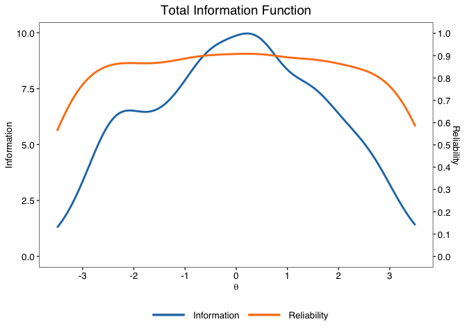
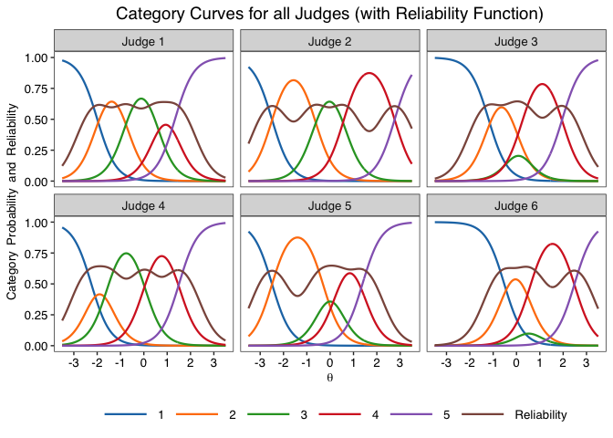
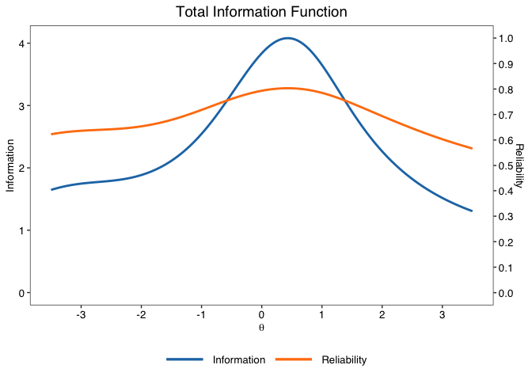
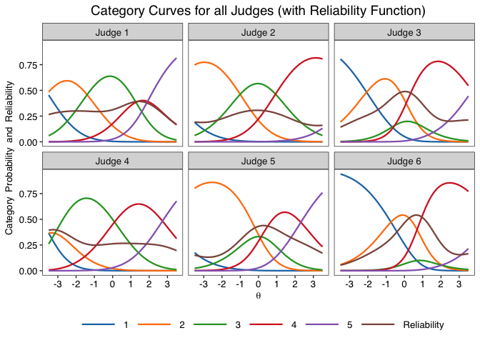
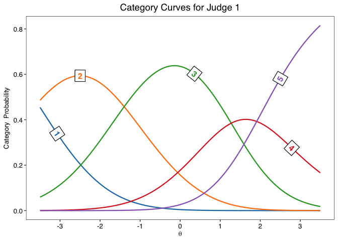
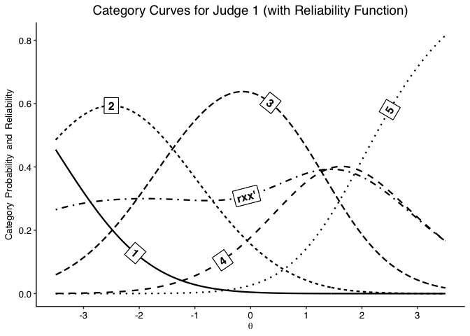

<!-- README.md is generated from README.Rmd. Please edit that file -->
jrt
===

The goal of jrt is to provide tools to use Item-Response Theory (IRT) models on judgment data, especially in the context of the Consensual Assessment Technique. It is based on "mirt" (Chalmers, 2012) as its estimation engine.

Installation
------------

You can install the released version of jrt from [CRAN](https://CRAN.R-project.org) with:

``` r
install.packages("jrt")
```

Example use
-----------

-   Load the library

``` r
library(jrt)
#> Loading required package: directlabels
```

-   To automatically select models

``` r
fit <- jrt(data, progress.bar = F)
#> The possible responses detected are: 1-2-3-4-5
#> 
#> Comparing models...
#> 
#> -== Automatic Model Selection ==-
#> AICc for Rating Scale Model: 4414.924
#> AICc for Generalized Rating Scale Model: 4310.307
#> AICc for Graded Response Model: 4007.604
#> AICc for Partial Credit Model: 4027.701
#> AICc for Generalized Partial Credit Model: 4021.567
#>  -> The best fitting model is the Graded Response Model.
#> 
#>  -== General Summary ==-
#> - 6 Judges
#> - 300 Products
#> - 5 response categories (1-2-3-4-5)
#> - Mean judgment = 2.977 | SD = 0.862
#> 
#> -== IRT Summary ==-
#> - Model: Graded Response Model (GRM; Samejima, 1969) | doi: 10.1007/BF03372160
#> - Estimation package: mirt (Chalmers, 2012) | doi: 10.18637/jss.v048.i06
#> - Estimation algorithm: Expectation-Maximization (EM; Bock & Atkin, 1981) | doi: 10.1007/BF02293801
#> - Method of factor scoring: Expected A Posteriori (EAP)
#> - AIC = 4000.69 | AICc = 4007.604 | BIC = 4111.803 | SABIC = 4000.69
#> 
#> -== Model-based reliability ==-
#> - Empirical reliability | Average in the sample: .896
#> - Expected reliability | Assumes a Normal(0,1) prior density: .896
```



-   To select models a priori

``` r
fit <- jrt(data, irt.model = "PCM")
#> The possible responses detected are: 1-2-3-4-5
#> 
#>  -== General Summary ==-
#> - 6 Judges
#> - 300 Products
#> - 5 response categories (1-2-3-4-5)
#> - Mean judgment = 2.977 | SD = 0.862
#> 
#> -== IRT Summary ==-
#> - Model: Partial Credit Model (PCM; Masters, 1982) | doi: 10.1007/BF02296272
#> - Estimation package: mirt (Chalmers, 2012) | doi: 10.18637/jss.v048.i06
#> - Estimation algorithm: Expectation-Maximization (EM; Bock & Atkin, 1981) | doi: 10.1007/BF02293801
#> - Method of factor scoring: Expected A Posteriori (EAP)
#> - AIC = 4022.957 | AICc = 4027.701 | BIC = 4115.551 | SABIC = 4022.957
#> 
#> -== Model-based reliability ==-
#> - Empirical reliability | Average in the sample: .889
#> - Expected reliability | Assumes a Normal(0,1) prior density: .759
```



-   To plot all category curves

``` r
jcc.plot(fit)
```


-   To plot on judge's category curves

``` r
jcc.plot(fit, judge = 1)
```



-   Graphical options

``` r
jcc.plot(fit, judge = 1, overlay.reliability = T, greyscale = T, theme = "classic")
```



-   To plot total information

``` r
info.plot(fit)
```


-   To plot judge information

``` r
info.plot(fit, judge = 1)
```


-   Other options for information plots

``` r
info.plot(fit, type = "Reliability",
          max.y = 1,
          y.line = .70,
          theta.span = 4,
          theme = "classic")
```


